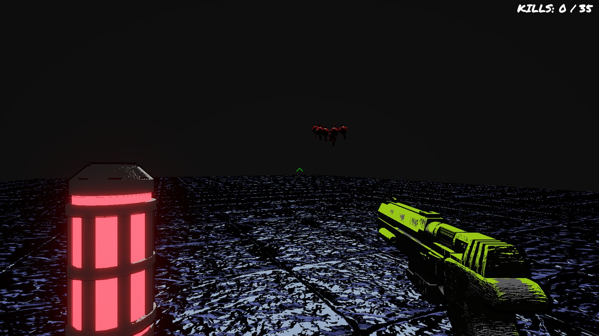
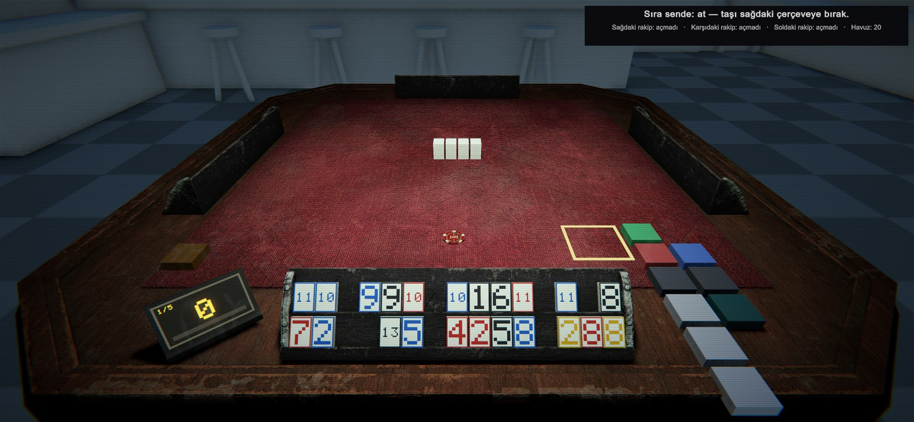
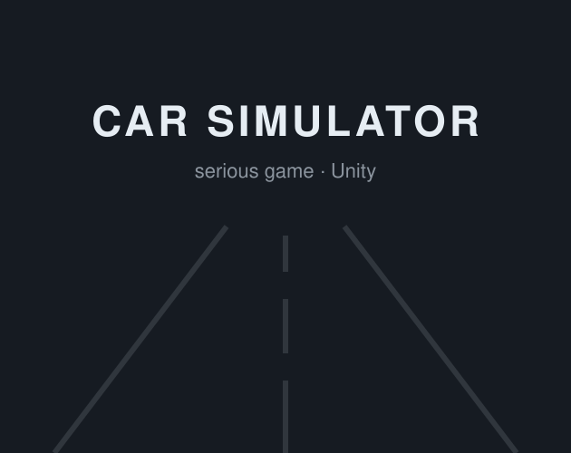

# Hi, I'm Uzay 👋

**Game Designer & Unity Developer** · Istanbul, Turkey

I design games and build them in Unity and C#, with AI agents as part of my everyday workflow.

---

## Devil Engine

A fast, skill-based first-person roguelike boomer shooter. A gun in one hand, a katana in the other: tear through
five brutalist arenas against swarms that spawn in packs, with one life and a hidden kill quota pushing you forward.

- Dual-wielding: automatic pistol and katana, each upgraded through five tiers between arenas
- Bullet time that freezes the world but not you, dashes and sword waves
- Black-and-white ink look with neon accents, inspired by Tsutomu Nihei's megastructures

Unity 6 · C# · URP · in development &nbsp;·&nbsp; [**Play on itch.io →**](https://ayill.itch.io/devil-engine)

## ROGUE101

A first-person psychological horror roguelike built on 101 Okey, the Turkish rummy. Sit at a dark table against three
uncanny opponents, hit each round's target score and beat their penalties, then bend the rules with Balatro-style power-ups.

- Every tile is a physical object: pick it up, arrange your rack, throw it on the table
- Full 101 Okey rules in a pure C# engine, covered by 260+ unit tests
- Three AI opponents that open, lay off and discard on their own

Unity 6 · C# · URP · in development

---

## Other projects

<table>
<tr>
<td width="25%" valign="top"> <b>Car Simulator</b> Serious game that teaches beginners to drive</td>
<td width="25%" valign="top"> <b>Christmas Error</b> Survival horror, game jam</td>
<td width="25%" valign="top"> <b>Baloncuk Sorunsalı</b> Choice-based, Global Game Jam 2025</td>
<td width="25%" valign="top"> <b>PARQUERADE</b> Cyberpunk parkour, game jam</td>
</tr>
</table>

More of my games on [**itch.io →**](https://ka1ba.itch.io)

## Tools

I work with LLM agents as a daily part of development: coding agents that read the codebase, write and run tests, and
drive the Unity Editor directly through MCP to build scenes and play-test.

🎮 What I'm playing: [Backloggd](https://backloggd.com/u/UzayAcik/)
